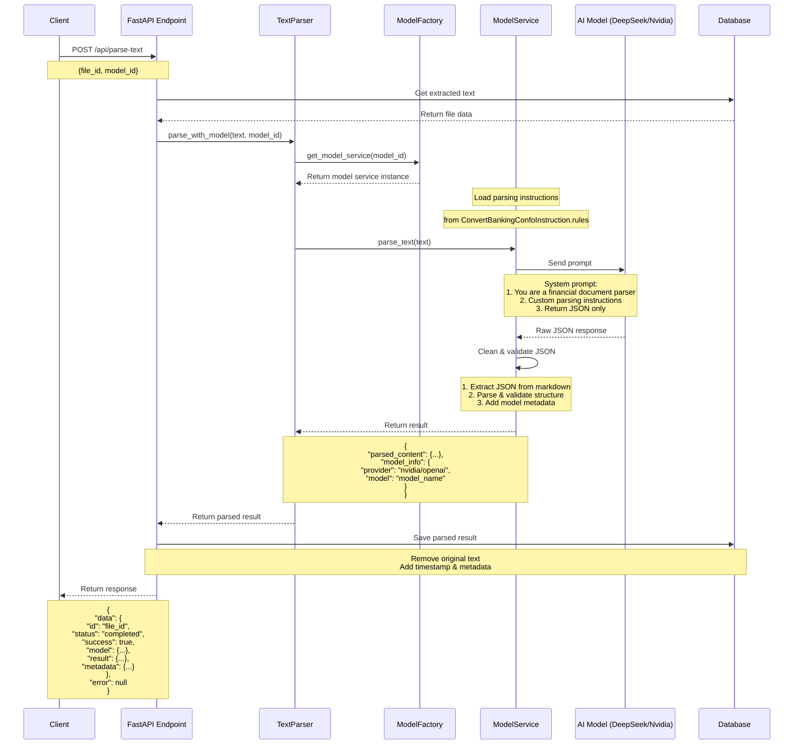

# AI Workflow Documentation

This document describes the workflow of AI processing in our system.

## Key Components

1. **Text Parser**
   - Manages the parsing workflow
   - Interfaces with model services
   - Handles initial error checking

2. **Model Factory**
   - Creates appropriate model service instances
   - Supports multiple model types (DeepSeek, Nvidia)
   - Enables easy addition of new models

3. **Model Services**
   - Handles model-specific implementations
   - Loads parsing instructions
   - Manages prompts and response processing
   - Ensures consistent output format

4. **AI Models**
   - DeepSeek Chat
   - Nvidia Deepseek
   - Both accessed via OpenAI-compatible API

## Data Flow

1. **Input**
   - File ID and model selection
   - Extracted text from PDF
   - Parsing instructions

2. **Processing**
   - System prompt construction
   - AI model processing
   - JSON extraction and validation
   - Metadata addition

3. **Output**
   - Structured JSON data
   - Model information
   - Processing metadata
   - Status and error handling

## Error Handling

- Input validation at each step
- Comprehensive error logging
- Structured error responses
- Transaction rollback for database operations