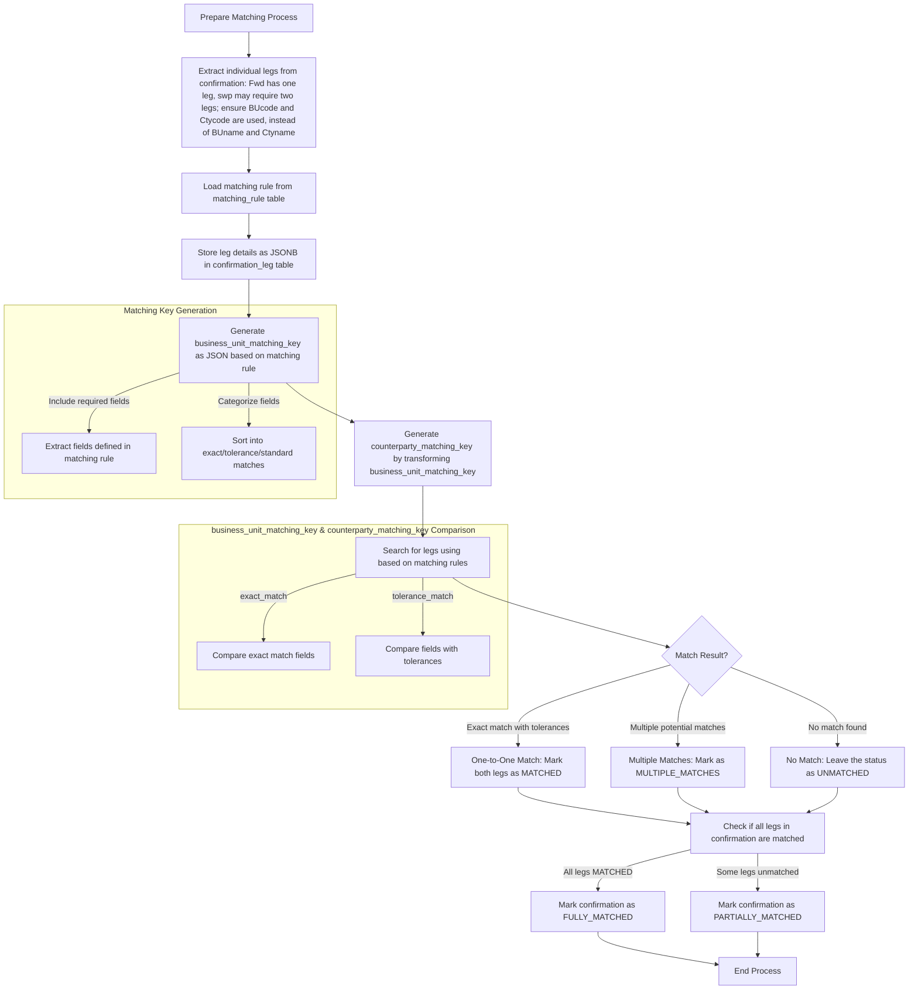

## Technical Implementation Details

### 1. Database Table Structures

#### 1.1 Confirmation Leg Table
```sql
CREATE TABLE confirmation_legs (
    leg_id UUID PRIMARY KEY DEFAULT gen_random_uuid(),
    confirmation_id UUID NOT NULL,
    leg_details JSONB NOT NULL,  -- Stores all FX trade details flexibly
    matching_rule_id UUID NOT NULL,
    match_status VARCHAR(20) NOT NULL DEFAULT 'UNMATCHED',
    business_unit_matching_key JSONB,  -- Changed from TEXT to JSONB
    counterparty_matching_key JSONB,   -- Changed from TEXT to JSONB
    matched_leg_id UUID,
    created_at TIMESTAMP WITH TIME ZONE DEFAULT CURRENT_TIMESTAMP,
    updated_at TIMESTAMP WITH TIME ZONE DEFAULT CURRENT_TIMESTAMP,
    FOREIGN KEY (matching_rule_id) REFERENCES matching_rules(rule_id),
    FOREIGN KEY (matched_leg_id) REFERENCES confirmation_legs(leg_id)
);
```

Example leg_details JSONB:
```json
{
    "trading_business_unit_code": "KR1",
    "counterparty_code": "HSBC_KR_001",
    "business_unit_buy_sell": "Buy",
    "trading_currency": "KRW",
    "trading_ccy_amount": 75526403,
    "settlement_currency": "USD",
    "settlement_ccy_amount": 54171.86,
    "value_date": "2024-11-26",
    "trade_date": "2024-11-22",
    "trade_id": "EOS243279968"
}
```

#### 1.2 Matching Rule Table
```sql
CREATE TABLE matching_rules (
    rule_id UUID PRIMARY KEY DEFAULT gen_random_uuid(),
    rule_name VARCHAR(100) NOT NULL,
    rule_description TEXT,
    matching_fields JSONB NOT NULL,
    is_active BOOLEAN DEFAULT true,
    created_at TIMESTAMP WITH TIME ZONE DEFAULT CURRENT_TIMESTAMP,
    updated_at TIMESTAMP WITH TIME ZONE DEFAULT CURRENT_TIMESTAMP
);
```

Example matching_fields JSONB:
```json
{
    "exact_match": [
        "trading_business_unit_code",
        "counterparty_code",
        "business_unit_buy_sell",
        "value_date",
        "trading_currency",
        "settlement_currency"
    ],
    "tolerances": {
        "settlement_ccy_amount": 0.01,
        "trading_ccy_amount": 1.0
    }
}
```

### 2. Matching Key Generation and Comparison
```python
def generate_business_unit_key(leg_details: dict, matching_rule: dict) -> dict:
    """Generate a business unit matching key in JSON format with matching requirements"""
    key = {
        "exact_match": {},
        "tolerance_match": {}
    }
    
    # Handle exact match fields
    for field in matching_rule['exact_match']:
        if field in leg_details:
            key["exact_match"][field] = leg_details[field]
    
    # Handle fields with tolerances
    for field, tolerance in matching_rule['tolerances'].items():
        if field in leg_details:
            key["tolerance_match"][field] = {
                "value": leg_details[field],
                "tolerance": tolerance
            }
            
    return key

def generate_counterparty_key(business_unit_key: dict) -> dict:
    """Generate counterparty matching key by transforming business unit key"""
    key = {
        "exact_match": business_unit_key["exact_match"].copy(),
        "tolerance_match": business_unit_key["tolerance_match"].copy()
    }
    
    # Handle business unit code swap and buy/sell reversal
    if "trading_business_unit_code" in key["exact_match"] and "counterparty_code" in key["exact_match"]:
        key["exact_match"]["trading_business_unit_code"], key["exact_match"]["counterparty_code"] = (
            key["exact_match"]["counterparty_code"],
            key["exact_match"]["trading_business_unit_code"]
        )
    
    if "business_unit_buy_sell" in key["exact_match"]:
        key["exact_match"]["business_unit_buy_sell"] = (
            'Sell' if key["exact_match"]["business_unit_buy_sell"] == 'Buy' else 'Buy'
        )
    
    return key

def is_matching(key1: dict, key2: dict) -> bool:
    """Compare two keys considering their matching requirements"""
    # Check exact match fields
    if key1["exact_match"] != key2["exact_match"]:
        return False
    
    # Check tolerance match fields
    for field, data in key1["tolerance_match"].items():
        if field not in key2["tolerance_match"]:
            return False
        value1 = float(data["value"])
        value2 = float(key2["tolerance_match"][field]["value"])
        tolerance = min(data["tolerance"], key2["tolerance_match"][field]["tolerance"])
        if abs(value1 - value2) > tolerance:
            return False
    
    return True
```

Example matching key structure:
```python
{
    "exact_match": {
        "value_date": "2024-11-26",
        "trading_currency": "KRW",
        "settlement_currency": "USD",
        "trading_business_unit_code": "KR1",
        "counterparty_code": "HSBC_KR_001",
        "business_unit_buy_sell": "Buy"
    },
    "tolerance_match": {
        "settlement_ccy_amount": {
            "value": 54171.86,
            "tolerance": 0.01
        },
        "trading_ccy_amount": {
            "value": 75526403,
            "tolerance": 1.0
        }
    }
}
```

Database query would need to be updated to handle this structure:
```sql
-- Create function to check matching based on the structured keys
CREATE OR REPLACE FUNCTION check_matching_keys(key1 JSONB, key2 JSONB)
RETURNS BOOLEAN AS $$
DECLARE
    tolerance NUMERIC;
    value1 NUMERIC;
    value2 NUMERIC;
BEGIN
    -- First check exact matches
    IF NOT (key1->'exact_match' = key2->'exact_match') THEN
        RETURN FALSE;
    END IF;
    
    -- Then check tolerance matches
    FOR field IN SELECT jsonb_object_keys(key1->'tolerance_match')
    LOOP
        value1 := ((key1->'tolerance_match'->field)->>'value')::NUMERIC;
        value2 := ((key2->'tolerance_match'->field)->>'value')::NUMERIC;
        tolerance := LEAST(
            ((key1->'tolerance_match'->field)->>'tolerance')::NUMERIC,
            ((key2->'tolerance_match'->field)->>'tolerance')::NUMERIC
        );
        
        IF ABS(value1 - value2) > tolerance THEN
            RETURN FALSE;
        END IF;
    END LOOP;
    
    RETURN TRUE;
END;
$$ LANGUAGE plpgsql;

-- Find matching legs
SELECT * FROM confirmation_leg cl
WHERE check_matching_keys(
    cl.counterparty_matching_key,
    :business_unit_matching_key::jsonb
);
```

#### Database Considerations
```sql
-- Add B-tree indexes for JSON matching
CREATE INDEX idx_bu_matching_key_exact ON confirmation_legs ((business_unit_matching_key->'exact_match'));
CREATE INDEX idx_cp_matching_key_exact ON confirmation_legs ((counterparty_matching_key->'exact_match'));

-- Index on match_status for quick filtering
CREATE INDEX idx_match_status ON confirmation_legs (match_status);
```

### 3. Leg Extraction Rules
For each FX confirmation:
1. Create first leg using original data
2. Create second leg by:
   - Swap trading_business_unit_code and counterparty_code
   - Reverse business_unit_buy_sell (Buy → Sell, Sell → Buy)
   - Keep amounts and currencies the same
   - Generate new leg_id
   - Reference same confirmation_id

### 4. Match Status Workflow
1. Initial status: UNMATCHED
2. After finding match:
   - One match: Update both legs to MATCHED
   - Multiple matches: Update to MULTIPLE_MATCHES
   - No match: Remain as UNMATCHED
3. When all legs are MATCHED, update confirmation status to FULLY_MATCHED
4. If any leg is not MATCHED, confirmation status becomes PARTIALLY_MATCHED

### 5. Tolerance Rules
Consider implementing tolerance checks for amount matching:
- Amount tolerance: ±0.01 in settlement currency
- Date matching: Exact match required for value_date
- Currency pairs must match exactly (no tolerance)

### 6. Performance Considerations
- Index the matching_key columns for faster lookups
- Consider partitioning large tables by date
- Implement batch processing for high volume periods

