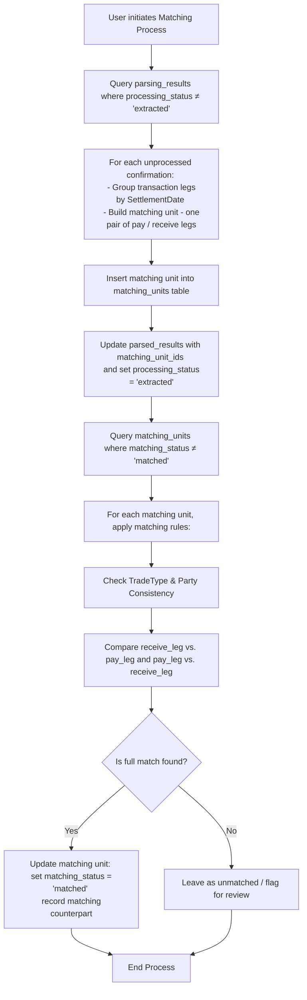

## Technical Implementation Details

1. Matching Rules Definition (in matching_rules table)
When comparing two parsed JSON confirmations (referred to as “this” and “other”), consider them a match if all of the following conditions are met:

    A. Trade Type and Party Consistency
    TradeType Check:
    Both confirmations must have a TradeType in: [ForeignExchangeSWAP, ForeignExchangeForward, ForeignExchangeSpot]
    Party Mapping:
        this.TradingPartyCode equals other.CounterpartyCode
        this.CounterpartyCode equals other.TradingPartyCode
    B. Explicit Leg Comparison
        Leg Matching Rules:
        The receive_leg of one confirmation must match the pay_leg of the other (its counterparty):
            this.receive_leg.Amount equals other.pay_leg.Amount
            this.receive_leg.Currency equals other.pay_leg.Currency
            this.receive_leg.TradeDate equals other.pay_leg.TradeDate
            this.receive_leg.SettlementDate equals other.pay_leg.SettlementDate
        The pay_leg of one confirmation must match the receive_leg of the other (its counterparty):
            this.pay_leg.Amount equals other.receive_leg.Amount
            this.pay_leg.Currency equals other.receive_leg.Currency
            this.pay_leg.TradeDate equals other.receive_leg.TradeDate
            this.pay_leg.SettlementDate equals other.receive_leg.SettlementDate
        Note: By storing leg amounts as absolute values, you no longer need to apply a –1 multiplier. This explicit rule ensures that both legs are evaluated together as a single atomic matching unit.

2. Matching Units Table (matching_units)
The matching_units are built based on the parsed_result. 
Each record (matching unit) represents one pair of pay & receive legs on the same settlement day. For confirmations containing multiple pairs (e.g., FX swaps), split them into separate matching unit records.

    Core Fields
        parsing_result_id
        matching_rule_id
        matching_status (values: unmatched or matched; set to matched only when both legs are paired with a counterpart)
        TradeType
        TradeDate
        SettlementDate
        TradingPartyCode
        CounterpartyCode
        Transaction Details (stored as JSONB)        
        {
            "pay_leg": {
                "Amount": <positive_number>,
                "Currency": "<currency_code>"
            },
            "receive_leg": {
                "Amount": <positive_number>,
                "Currency": "<currency_code>"
            }
        }

 Note: Once matching units are built, their matching_unit_ids should be saved back into the original parsed_results record to maintain traceability.
 
3. Extraction Phase
When the user initiates matching with a specified matching rule, perform the following steps:

Query:
Retrieve all records in the parsing_results table that have not yet been processed (i.e. processing_status <> 'extracted').

Extract Matching Units:
For each unprocessed confirmation, build the matching unit by grouping the two transaction legs (which must share the same SettlementDate) into one record.

Insert:
Insert the matching unit into the matching_units table.

Update:
Update the original parsed_result record’s matching_units (stored in a JSONB field) with the new matching_unit_ids and mark its processing_status as 'extracted'.

4. Matching Phase
After extraction, proceed with the matching:

Select:
Retrieve all records in the matching_units table where matching_status <> 'matched'.

Comparison:
For each matching unit, apply the matching rule defined in Step 1 to find a corresponding counterpart from another confirmation.

Update:

If a full match is found (both legs are paired appropriately), update the matching unit’s matching_status to matched and record the corresponding parsing_result_id (or matching unit ID) with which it matched.
If no match is found, leave the record as unmatched and optionally flag it for manual review.